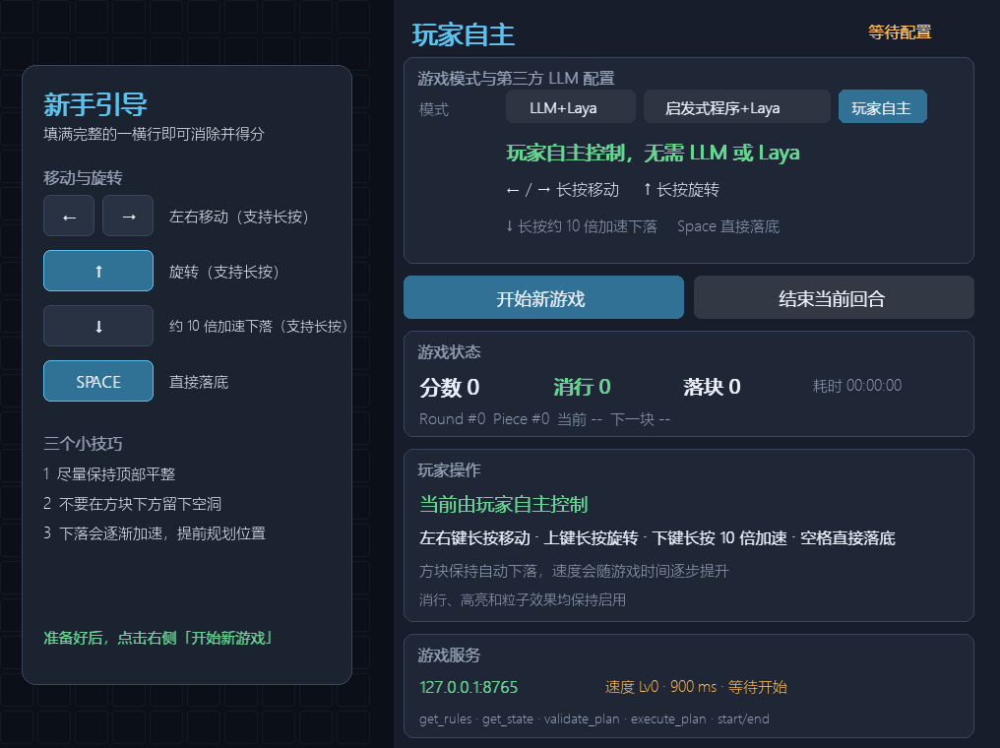

# Tetris Laya LLM

一个用于演示 **第三方 LLM 或启发式规划、可选本地 Laya 复核与实时俄罗斯方块交互** 的 Python 项目。

项目提供三种游戏模式：

1. **LLM**：第三方 LLM 根据原始规则和游戏状态规划多个策略并给出最终选择；可勾选本地 Laya 进行复核。
2. **启发式程序**：单步评分并筛出最多4个落点；可选本地 Laya 对每个候选评分，并用危险高度护栏过滤高风险选择。
3. **玩家自主**：玩家通过键盘直接控制方块。

方块在 AI 规划和可选 Laya 复核期间仍会自动下落。如果策略返回时当前方块已经落地，游戏会拒绝过期策略，避免把旧决策错误地应用到下一方块。



## 功能特性

- 10×20 俄罗斯方块棋盘与七袋随机系统
- 方块自动下落，并随游戏时间逐步加速
- 左右移动和旋转不重置、不推迟自动下落计时
- 分数、消行数、落块数和运行时间统计
- 消行高亮与轻量粒子效果
- 本地 TCP JSONL 游戏控制服务
- 决策回合与方块编号校验
- 第三方 OpenAI-compatible LLM 接入
- 可插拔的本地 Laya 复核（不启用时不会阻塞游戏）
- 单步启发式候选筛选与可选 Laya `noul` 评分
- 玩家长按操作与11倍软降
- 游戏开始前的新手引导

## 项目结构

```text
.
├── README.md
├── src/
│   ├── main.py                 # 统一入口、整合面板与模式编排
│   ├── teris.py                # 游戏引擎、基础面板和控制服务
│   ├── tetris_llm.py           # 第三方 LLM 客户端与策略规划
│   ├── tetris_laya.py          # 本地 Laya 加载与候选复核
│   ├── tetris_heuristic.py     # 单步评分与候选筛选
│   ├── tetris_player.py        # 玩家键位、长按和软降逻辑
│   └── laya_json_service.py    # 可选的独立 Laya JSON/JSONL 服务
└── assets/
    └── images/                 # 界面渲染测试截图
```

主要调用关系：

```text
src/main.py
├─ LLM（可选 Laya）
│  └─ 规则/状态/客观落底结果 → tetris_llm → 规则校验 → [tetris_laya] → 交互动作执行
├─ 启发式程序（可选 Laya）
│  └─ 合法落点 → 单步启发式短名单 → [Laya逐候选评分与高度护栏] → 交互动作执行
└─ 玩家自主
   └─ 键盘输入 → tetris_player → GameController → 游戏引擎
```

## 环境要求

- Windows、Linux 或 macOS
- **优先推荐 Python 3.11.x**
- 推荐使用虚拟环境
- 若使用第三方 LLM 模式，需要一个兼容 OpenAI Chat Completions 的服务
- 启用 Laya 复核时，首次加载默认模型需要能够访问 Hugging Face，或提前准备好本地模型缓存

Laya 官方声明要求 **Python 3.10 或更高版本**，其项目元数据列出了 Python 3.10、3.11、3.12 和 3.13。本文档优先推荐 Python 3.11，是为了在满足官方要求的同时，兼顾 PyTorch、Transformers 等本地推理依赖的兼容性；这属于本项目的部署建议，不代表 Laya 官方仅支持 Python 3.11。

- [Laya 官方模型说明](https://huggingface.co/convaiinnovations/laya/blob/main/README.md)
- [Laya 官方 Python 版本声明](https://github.com/NandhaKishorM/laya/blob/main/pyproject.toml)

推荐的本地部署组合：

```text
Python 3.11.x
pygame 2.6.x
laya（可选，使用当前稳定版本）
torch 2.x（启用 Laya 时需要；CPU 或与本机 CUDA 匹配的版本）
```

## 安装

### 1. 克隆或进入项目

```powershell
cd D:\Workspace\Models\laya-local\tetris_laya_llm
```

如果从 Git 仓库安装：

```bash
git clone <仓库地址>
cd tetris_laya_llm
```

### 2. 创建虚拟环境

Windows PowerShell：

```powershell
py -3.11 --version
py -3.11 -m venv .venv
.\.venv\Scripts\Activate.ps1
```

Linux/macOS：

```bash
python3.11 --version
python3.11 -m venv .venv
source .venv/bin/activate
```

如果 PowerShell 禁止执行激活脚本，可以在当前终端临时调整策略：

```powershell
Set-ExecutionPolicy -Scope Process -ExecutionPolicy Bypass
.\.venv\Scripts\Activate.ps1
```

### 3. 安装依赖

```bash
python -m pip install --upgrade pip setuptools wheel
python -m pip install --upgrade pygame
```

如需启用可选的 Laya 复核，再安装：

```bash
python -m pip install --upgrade laya
```

Laya 官方的基础安装命令是 `pip install laya`。基础包已经满足本项目需求，不必额外安装 `laya[serve]`、`laya[mcp]` 等可选组件。安装 `laya` 时会同时解析 `torch`、`transformers`、`huggingface_hub`、`safetensors` 和 `numpy` 等依赖。若不使用 Laya，LLM、启发式程序和玩家自主模式均不需要加载 Laya 模型。

如果需要使用 NVIDIA GPU，请先根据本机 CUDA 环境安装匹配的 PyTorch，再安装 `laya` 和 `pygame`。仅用于体验本项目时，CPU 版本也可以运行，但 Laya 推理速度会更慢。

### 4. 验证安装

```bash
python --version
python -c "import pygame; print('pygame', pygame.version.ver)"
```

`python --version` 应优先显示 `Python 3.11.x`。

如果安装了可选的 Laya，再验证其推理依赖：

```bash
python -c "import laya, torch; print('torch', torch.__version__); print('CUDA available', torch.cuda.is_available())"
```

## 启动游戏

激活虚拟环境后运行：

```bash
python src/main.py
```

可选参数：

```bash
python src/main.py --host 127.0.0.1 --port 8765 --fall-ms 600
```

- `--host`：控制服务监听地址，默认 `127.0.0.1`
- `--port`：控制服务端口，默认 `8765`
- `--fall-ms`：初始自动下落间隔，默认 `600ms`（相比原来的 `900ms`，速度提升 50%）

程序启动后只会准备窗口和服务。选择模式并点击 **开始新游戏** 后，才会生成方块并开始计时。

开始按钮会根据当前模式和 Laya 开关的依赖状态自动启用：

- **LLM**：Base URL、模型名称已经填写；勾选 Laya 复核时，还必须等待本地 Laya 加载完成；
- **启发式程序**：不勾选 Laya 时可直接开始；勾选后必须等待本地 Laya 加载完成；
- **玩家自主**：不依赖 LLM 或 Laya，可直接开始。

条件未满足时，**开始新游戏** 按钮保持置灰且不可点击。只有勾选“使用 Laya 复核”后，Laya 的加载状态才会影响 Ready 状态。

## 三种游戏模式

### LLM（可选 Laya）

该模式要求在面板中填写：

- **Base URL**：OpenAI-compatible 服务地址，例如 `http://127.0.0.1:1234/v1`
- **模型**：第三方服务使用的模型名称
- **API Key**：远程服务通常必填，本地服务可按实际情况留空

输入框支持：

- `Ctrl+V`
- `Shift+Insert`
- 输入框内右键粘贴
- 鼠标点击定位光标，按住左键拖动选择文本
- `←` / `→`、`Home` / `End` 移动光标，配合 `Shift` 扩展选区，`Ctrl+A` 全选
- 长按 `Backspace` 连续向前删除；`Delete`、`←`、`→` 同样支持长按
- `Ctrl+C` 复制选区，`Ctrl+X` 剪切选区，`Ctrl+V` 替换选区或在光标处粘贴
- Windows 下优先读取系统剪贴板，确保外部程序刚复制的内容可以立即粘贴
- 在任意输入框粘贴三行文本时，自动按“Base URL、模型、API Key”的顺序覆盖填充三个输入框

例如复制以下三行，并在任意一个配置输入框中粘贴：

```text
https://api.deepseek.com
deepseek-flash
your-api-key
```

决策流程：

```text
get_rules + get_state + 游戏物理枚举
        ↓
引擎提供全部合法动作及客观落底结果（不评分、不排序、不推荐）
        ↓
LLM 比较完整结果集，生成并排序4个策略
        ↓
LLM 指定自己的最终选择
        ↓
如启用，Laya 从合法候选中复核选择一个
        ↓
游戏服务依次旋转、逐格左右移动，再 hard_drop 直接落底
```

LLM 模式不会调用启发式规划器，也不会获得启发式评分或程序推荐。游戏引擎只负责确定性的物理计算，向 LLM 提供每个合法动作的落底棋盘、消行数、空洞数、列高和崎岖度等客观结果；全部战略比较、候选排序与最终规划仍由 LLM 完成。这样避免要求语言模型自行完成容易出错的二维碰撞模拟，同时不把启发式程序接入 LLM 模式。
未勾选 Laya 时，LLM 响应中的 `final_choice` 是绑定的最终决策；勾选后，Laya 会收到同一套客观落底指标，并在规则校验通过的候选中作出最终复核选择。Laya 采用保守复核策略：以 LLM 的最终选择为基线，只有其他候选在空洞、危险高度等指标上具有明确安全优势时才推翻它。
执行阶段不会直接改写方块形状或横坐标；旋转、移动和直接落底均复用玩家模式对应的游戏动作。若执行前方块已经自然落地，或者目标路径在当前高度已不可达，该次决策会失效，不会把动作应用到下一方块。

### 启发式程序（可选 Laya）

该模式不需要第三方 LLM 配置。

游戏引擎先枚举当前方块所有合法落点，启发式按消行、空洞增量、总高度变化和表面崎岖度计算单步分数，再筛出最多4个不同候选。该流程参考 `laya-Ascend/examples/tetris` 的候选评分方式。

未勾选 Laya 时，启发式最高分候选直接执行，适合作为本地基线。勾选后，Laya 会分别对每个候选调用一次 `noul` 问题“这是一个好的落点吗？”，执行 `P(好落点)` 最高者；如果该候选堆高超过15格，则护栏会改选不超过15格且 Laya 评分最高的候选（若存在）。Laya 不做多步搜索，候选仍由启发式短名单限制。

候选确定后，游戏服务依次执行旋转、逐格左右移动和 `hard_drop`，不会把方块瞬移到目标位置。

### 玩家自主

键位如下：

| 按键 | 操作 |
|---|---|
| `←` / `→` | 左右移动，支持长按 |
| `↑` | 顺时针旋转，支持长按 |
| `↓` | 约11倍速度软降，支持长按 |
| `Space` | 直接落底 |

玩家模式不会调用 LLM、启发式规划器或 Laya。

## Laya 本地化部署与模型配置

Laya 是可选复核模块。只有勾选面板中的 **使用 Laya 复核（可选）** 时，程序才会按需加载模型；未勾选时不会等待或调用 Laya。

默认模型：

```text
convaiinnovations/laya
```

模型主页：<https://huggingface.co/convaiinnovations/laya>

### 在线加载并建立本地缓存

首次调用时，Laya 会从 Hugging Face 下载模型并写入本地缓存。官方说明中，默认英文根模型的下载量约为 808 MB；请预留足够的磁盘空间，并保证首次运行时能够访问 Hugging Face。

可以先单独执行一次模型加载，完成下载和初始化验证：

```bash
python -c "import laya; agent = laya.load('convaiinnovations/laya'); print(type(agent).__name__)"
```

此后再运行游戏时会复用缓存，无须重复下载相同文件。

如需把 Hugging Face 缓存统一放到指定磁盘，可在首次下载前设置 `HF_HOME`：

Windows PowerShell：

```powershell
$env:HF_HOME = "D:\Models\huggingface-cache"
python -c "import laya; laya.load('convaiinnovations/laya')"
```

Linux/macOS：

```bash
export HF_HOME="$HOME/models/huggingface-cache"
python -c "import laya; laya.load('convaiinnovations/laya')"
```

### 指定模型 ID 或本地模型目录

项目通过 `LAYA_MODEL` 读取模型位置。该值既可以是 Hugging Face 模型 ID，也可以是已经准备好的本地模型目录。

Windows PowerShell：

```powershell
$env:LAYA_MODEL = "convaiinnovations/laya"
python src/main.py
```

完全使用本地模型目录时：

```powershell
$env:LAYA_MODEL = "D:\Models\laya"
python src/main.py
```

Linux/macOS：

```bash
export LAYA_MODEL="convaiinnovations/laya"
python src/main.py
```

### CPU 与 GPU

- `src/main.py` 使用 Laya 的默认设备选择逻辑。
- CPU 无须 CUDA，安装简单，但复核决策延迟通常更高。
- NVIDIA GPU 应安装与本机驱动、CUDA 环境匹配的 PyTorch 构建版本。
- 独立 JSON 服务可显式指定设备，例如 `python src/laya_json_service.py --device cpu` 或 `--device cuda`。

### 避免 TensorFlow 探测阻塞

Laya 官方说明提到，如果 `laya.load()` 因 TensorFlow 探测而长时间无响应，可在启动前禁用 TensorFlow 后端：

Windows PowerShell：

```powershell
$env:USE_TF = "0"
python src/main.py
```

Linux/macOS：

```bash
export USE_TF=0
python src/main.py
```

## 第三方 LLM 环境变量

面板初始值可以通过环境变量设置。

Windows PowerShell 示例：

```powershell
$env:THIRD_PARTY_LLM_BASE_URL = "http://127.0.0.1:1234/v1"
$env:THIRD_PARTY_LLM_MODEL = "your-model-name"
$env:THIRD_PARTY_LLM_API_KEY = ""
$env:THIRD_PARTY_LLM_TIMEOUT = "45"
$env:THIRD_PARTY_LLM_MAX_TOKENS = "4096"
$env:TETRIS_PLANNER_MODE = "llm"
python src/main.py
```

`THIRD_PARTY_LLM_MAX_TOKENS` 控制规划响应的最大输出量，默认 `4096`。DeepSeek 可直接使用类似 `https://api.deepseek.com` 的 Base URL；程序会为 DeepSeek 自动启用 JSON Output，并关闭默认的高强度思考模式以满足实时决策要求。若其他兼容服务仍提示 `content` 为空，可继续提高该值，或在服务端关闭深度思考。

`TETRIS_PLANNER_MODE` 支持：

```text
llm
heuristic
player
```

## 游戏运行配置

可通过以下环境变量调整自动下落与加速规则：

| 环境变量 | 默认值 | 说明 |
|---|---:|---|
| `TETRIS_FALL_MS` | `600` | 初始每格下落间隔 |
| `TETRIS_MIN_FALL_MS` | `150` | 最快自动下落间隔 |
| `TETRIS_SPEEDUP_EVERY_SECONDS` | `30` | 每隔多少秒提升一次速度 |
| `TETRIS_SPEEDUP_STEP_MS` | `75` | 每次减少的下落间隔 |
| `TETRIS_CONTROL_PORT` | `8765` | 默认控制服务端口 |
| `TETRIS_USE_LAYA` | `1` | 面板中 Laya 复核开关的初始值；设为 `0` 默认关闭 |

例如：

```powershell
$env:TETRIS_FALL_MS = "800"
$env:TETRIS_MIN_FALL_MS = "120"
$env:TETRIS_SPEEDUP_EVERY_SECONDS = "25"
$env:TETRIS_SPEEDUP_STEP_MS = "60"
python src/main.py
```

## 独立游戏服务

除了统一入口，也可以单独启动游戏主体与控制服务：

```bash
python src/teris.py run
```

在另一个终端查询状态：

```bash
python src/teris.py rules
python src/teris.py state
```

常用命令：

```bash
python src/teris.py start
python src/teris.py state
python src/teris.py move left
python src/teris.py rotate
python src/teris.py soft-drop
python src/teris.py hard-drop
python src/teris.py end
```

统一入口 `src/main.py` 启动时已经会占用控制端口，因此不要同时用相同端口运行 `src/teris.py run`。

## 独立 Laya JSON 服务

`src/laya_json_service.py` 可将本地 Laya 作为通用 JSON/JSONL 决策程序使用，它不是运行主游戏的必要组件。

一次性请求：

```powershell
python src/laya_json_service.py --input request.json --pretty
```

常驻 JSONL 模式：

```bash
python src/laya_json_service.py --loop
```

输入格式示例：

```json
{
  "state": "当前状态描述",
  "questions": {
    "select": {
      "type": "choice",
      "instructions": "请选择最佳方案",
      "criteria": {
        "A": "方案 A",
        "B": "方案 B"
      }
    }
  }
}
```

## 实时决策与安全约束

- AI 规划期间游戏不会暂停。
- 每个策略都绑定 `round_serial` 和 `piece_serial`。
- 方块已经落地或回合已经变化时，旧策略会被拒绝。
- 若规划尚未返回而当前方块已经落底，旧任务立即作废并为新方块启动规划；旧响应稍后返回也不会进入 Laya 或执行阶段。
- 迟到策略不会作用到下一方块。
- 游戏窗口被关闭后，本地控制服务会一并停止。
- LLM 规划失败时，当前方块继续自然下落。

## 常见问题

### 第一次启动很慢

勾选 Laya 复核后，首次运行需要加载或下载模型并初始化 PyTorch，之后通常会使用本地缓存。不使用 Laya 时取消勾选即可，LLM 或启发式程序模式不必等待模型加载。

### 出现 Laya temperature 警告

部分检查点可能包含超出推荐范围的 temperature。Laya 会自动使用安全值继续运行；警告中涉及的置信度应视为未校准数据，但不会阻止游戏启动。

### LLM 决策经常过期

游戏在 LLM 推理期间仍然自动下落。可以：

- 使用响应更快的模型或本地推理服务；
- 减小模型输出延迟；
- 适当增大 `--fall-ms`；
- 提高第三方服务的硬件性能。

### 端口已被占用

指定其他端口：

```bash
python src/main.py --port 8766
```

### 本地 LLM 无需 API Key

如果本地 OpenAI-compatible 服务不验证密钥，API Key 可以留空。

## 开发说明

- `src/main.py` 是推荐入口。
- 游戏规则与状态变更应集中放在 `src/teris.py`。
- LLM 提示词与响应解析应放在 `src/tetris_llm.py`。
- Laya 相关选择逻辑应放在 `src/tetris_laya.py`。
- 启发式候选评分与短名单调整应放在 `src/tetris_heuristic.py`。
- 玩家键位和长按节奏应放在 `src/tetris_player.py`。
- 不要在 LLM 模块中调用启发式规划器，以保持两种模式边界清晰。

## License

本仓库暂未包含 License 文件。如需公开发布或分发，请先补充合适的开源许可证，并确认所使用模型和依赖的许可证要求。
